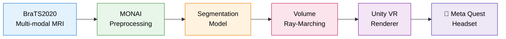

<div align="center">


# MedVisVR

### 🧠 Medical Visualization in Virtual Reality for Brain Tumor Segmentation

*An immersive VR platform for exploring multi-modal MRI scans and tumor segmentation in 3D*

<br/>

[](https://www.python.org/)
[](https://pytorch.org/)
[](https://monai.io/)
[](https://unity.com/)
[](https://www.meta.com/quest/)

[](https://www.med.upenn.edu/cbica/brats2020/)
[](LICENSE)
[]()
[](https://www.cankaya.edu.tr/)

<br/>

**[Features](#-key-features)** · **[Architecture](#%EF%B8%8F-architecture)** · **[Installation](#-installation)** · **[Usage](#-usage)** · **[Team](#-development-team)** · **[Docs](#-documentation)**

</div>

---

## 🎬 Demo

<div align="center">


<sub><em>Real-time interactive 3D visualization of brain tumor segmentation in VR</em></sub>

</div>

---

## 🧭 Overview

**MedVisVR** is an advanced medical visualization platform that leverages Virtual Reality to provide immersive 3D analysis of brain tumor segmentation data. Built as the **CENG 407/408 Senior Design Project (2025–2026)** at Çankaya University, the project integrates state-of-the-art deep learning techniques with interactive VR environments to enhance medical image analysis and diagnostic workflows.

The system processes multi-modal MRI scans from the BraTS (Brain Tumor Segmentation) dataset and presents them in an intuitive, three-dimensional virtual reality interface — enabling medical professionals and researchers to explore and analyze brain tumors in unprecedented detail.

> [!NOTE]
> This project is in **active development** as a senior capstone. Features, APIs, and documentation may evolve rapidly until the final release.

---

## ✨ Key Features

| | |
|---|---|
| 🥽 **Immersive VR Visualization** | Explore MRI brain scans in true 3D on head-mounted displays |
| 🧠 **Multi-Modal MRI Support** | Simultaneous visualization of T1, T1ce, T2, and FLAIR sequences |
| ⚙️ **MONAI-Powered Pipeline** | Standardized, GPU-accelerated preprocessing for medical imaging |
| 🎯 **Tumor Segmentation** | BraTS2020 annotations integrated with deep learning inference |
| 🎮 **Intuitive VR Controls** | Natural controller-based manipulation of volumetric data |
| ⚡ **Real-time Rendering** | Smooth volume rendering optimized for standalone VR headsets |

---

## 🏗️ Architecture



---

## 🛠️ Tech Stack

<table>
  <tr>
    <td><strong>AI / Deep Learning</strong></td>
    <td>Python 3.8+ · PyTorch · MONAI · NumPy</td>
  </tr>
  <tr>
    <td><strong>Medical Imaging</strong></td>
    <td>Nibabel · NIfTI · DICOM</td>
  </tr>
  <tr>
    <td><strong>VR &amp; Rendering</strong></td>
    <td>Unity · Meta XR SDK · URP · Volume Ray-Marching</td>
  </tr>
  <tr>
    <td><strong>Supported Headsets</strong></td>
    <td>Meta Quest 2/3 (recommended) · HTC Vive · Valve Index</td>
  </tr>
</table>

---

## 🚀 Installation

> [!IMPORTANT]
> A CUDA-enabled GPU is **strongly recommended** for the preprocessing and segmentation pipeline.

<details>
<summary><strong>1. Prerequisites</strong></summary>

```bash
# Python 3.8 or higher
python --version

# CUDA-enabled GPU (recommended)
nvidia-smi
```

</details>

<details>
<summary><strong>2. Clone the Repository</strong></summary>

```bash
git clone https://github.com/CankayaUniversity/ceng-407-408-2025-2026-MedVisVR.git
cd ceng-407-408-2025-2026-MedVisVR
```

</details>

<details>
<summary><strong>3. Create a Virtual Environment</strong></summary>

```bash
python -m venv venv

# Linux / macOS
source venv/bin/activate

# Windows
venv\Scripts\activate
```

</details>

<details>
<summary><strong>4. Install Dependencies</strong></summary>

```bash
pip install torch torchvision torchaudio
pip install monai nibabel numpy
pip install -r requirements.txt
```

</details>

<details>
<summary><strong>5. VR Setup</strong></summary>

- Install the VR runtime for your headset (Oculus app, SteamVR, etc.)
- Connect your VR headset (USB-C or Air Link for Quest)
- Calibrate the play area in your headset's home environment

</details>

---

## 📊 Dataset

This project uses the **BraTS2020 (Brain Tumor Segmentation Challenge 2020)** dataset:

- **369 training cases** — multi-institutional pre-operative MRI scans
- **4 MRI modalities** — T1, T1ce (contrast-enhanced), T2, FLAIR
- **Manual segmentations** — expert-annotated tumor regions
- **3 tumor sub-regions** — enhancing tumor, peritumoral edema, necrotic core

<details>
<summary><strong>📁 Data Structure</strong></summary>

```
BraTS2020_TrainingData/
└── MICCAI_BraTS2020_TrainingData/
    ├── BraTS20_Training_001/
    │   ├── BraTS20_Training_001_t1.nii
    │   ├── BraTS20_Training_001_t1ce.nii
    │   ├── BraTS20_Training_001_t2.nii
    │   ├── BraTS20_Training_001_flair.nii
    │   └── BraTS20_Training_001_seg.nii
    └── ...
```

</details>

---

## 💻 Usage

### Data Preprocessing

```bash
python preprocessing.py
```

The pipeline performs: **multi-modal loading** → **RAS orientation** → **1mm³ resampling** → **intensity normalization** → **random augmentations** → **128×128×128 patch cropping**.

### Launching the VR Application

```bash
python main.py --mode vr
```

| Control | Action |
|---|---|
| 🤚 **Grip** | Rotate the volume |
| 🎯 **Trigger** | Select / interact |
| 🕹️ **Thumbstick** | Navigate slices |
| ☰ **Menu Button** | Open settings |

> [!TIP]
> For the smoothest VR experience on Meta Quest, use **Quest Link** over USB-C 3.0 or higher.

---

## 📂 Project Structure

```
MedVisVR/
├── src/
│   ├── preprocessing/     # Data preprocessing modules
│   ├── visualization/     # VR rendering engine
│   ├── segmentation/      # Tumor segmentation models
│   └── utils/             # Utility functions
├── data/
│   ├── raw/               # Raw BraTS data
│   └── preprocessed/      # Processed outputs
├── models/                # Trained model weights
├── config/                # Configuration files
├── tests/                 # Unit and integration tests
└── docs/                  # Additional documentation
```

---

## 🗺️ Roadmap

- [x] Project scoping and literature review
- [x] BraTS2020 dataset preprocessing pipeline
- [x] MONAI-based augmentation and patch extraction
- [ ] Tumor segmentation model training and evaluation
- [ ] Unity VR rendering engine with volume ray-marching
- [ ] Meta Quest 3 deployment and performance tuning
- [ ] User study and clinical evaluation
- [ ] Final report and demo release

---

## 👥 Development Team

**CENG 407/408 Senior Design Project · 2025–2026**

| Student No | Name | Role |
|:---:|:---|:---|
| 202111012 | Alperen Berke Çetinkaya | Team Member |
| 202211052 | Muhammed Yusuf Özcan | Team Member |
| 202211011 | Sezer Ataş | Team Member |
| 202211061 | Mete Serpil | Team Member |

**Advisor:** Assoc. Prof. Dr. Gül Tokdemir
**Institution:** [Çankaya University](https://www.cankaya.edu.tr/) — Department of Computer Engineering

---

## 📚 Documentation

For detailed documentation, please see the project documents repository:

- 📖 **Literature Review** — state-of-the-art analysis
- 🧪 **Methodology Report** — technical approach and architecture
- 📊 **Dataset Description** — BraTS2020 preprocessing details
- 📝 **Final Report** — complete project documentation

---

## 🤝 Contributing

Contributions are welcome! To contribute:

1. Fork the repository
2. Create a feature branch — `git checkout -b feature/AmazingFeature`
3. Commit your changes — `git commit -m 'Add AmazingFeature'`
4. Push to the branch — `git push origin feature/AmazingFeature`
5. Open a Pull Request

---

## 📜 License

This project is licensed under the MIT License — see the [LICENSE](LICENSE) file for details.

---

## 🙏 Acknowledgments

- **BraTS Challenge Organizers** — for providing the comprehensive dataset
- **MONAI Consortium** — for the medical imaging framework
- **PyTorch Team** — for the deep learning platform
- **Çankaya University** — for advising and supporting this capstone project

---

## 📖 Citation

If you use this project in your research, please cite:

```bibtex
@misc{medvisvr2026,
  title  = {MedVisVR: Medical Visualization in Virtual Reality for Brain Tumor Segmentation},
  author = {Çetinkaya, Alperen Berke and Özcan, Muhammed Yusuf and Ataş, Sezer and Serpil, Mete},
  year   = {2026},
  note   = {CENG 407/408 Senior Design Project, Çankaya University},
  url    = {https://github.com/CankayaUniversity/ceng-407-408-2025-2026-MedVisVR}
}
```

---

<div align="center">

### Made with ❤️ for advancing medical visualization

<sub>Çankaya University · Department of Computer Engineering · 2025–2026</sub>

</div>
